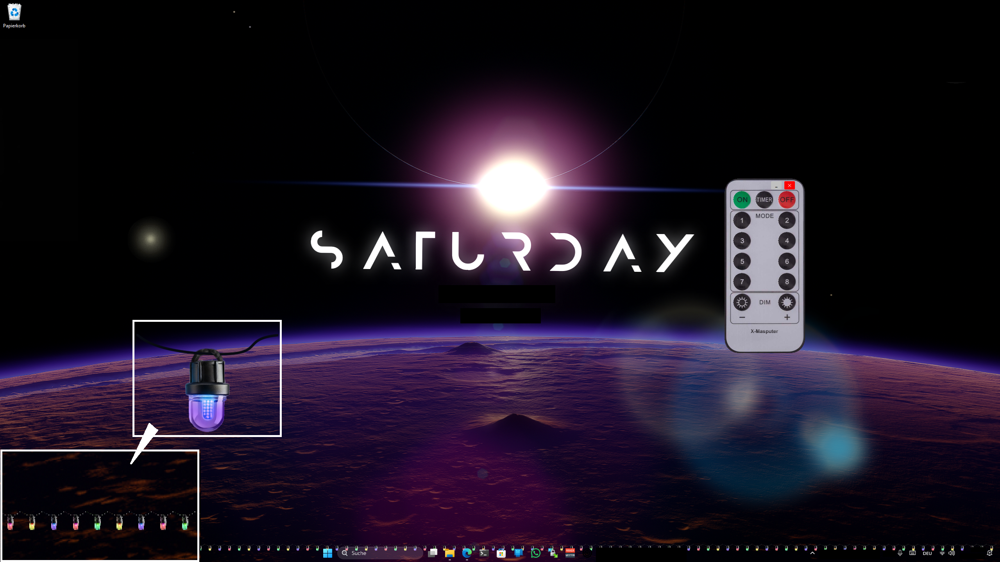

# X-Masputer 🎄

**X-Masputer** is a small Christmas-themed project designed to bring some holiday cheer to your computer. It adds a festive light chain above your taskbar, giving your setup a warm and seasonal touch.

_Program written by human, readme written by ai._



## Features ✨

- **Festive Light Chain:** Displays a string of colorful lights on your taskbar, supporting multiple screens.
- **Dynamic Animation Modes:** Choose from 8 different modes to customize how the lights behave, including:
  - **Mode 1:** Cycles through all colors.
  - **Mode 2-5:** Displays static colors like blue, red, green, or yellow.
  - **Mode 6 & 7:** Alternates between two colors (blue/red or green/yellow).
  - **Mode 8:** Creates random groups of lights with dynamic arrangements.
- **Adjustable Brightness:** Dim the lights up or down to match your mood or room lighting.
- **Multiple Screen Support:** Automatically adapts to your multi-monitor setup.
- **Customizable Speeds:** Adjust the animation speed with presets like Very Slow, Slow, Medium, Fast, and Very Fast.
- **Unobtrusive UI:** 
  - Transparent and unclickable lights for seamless taskbar interaction.
  - Notification tray integration for easy access to controls.
- **Compact Remote:** A beautifully rounded control panel lets you manage all settings with a single click.

## Getting Started 🚀

1. **Clone the repository:**
   
   ```bash
   git clone https://github.com/yourusername/x-masputer.git
   cd x-masputer
   ```

2. **Build the application:**
   Open the project in Visual Studio and compile it. Ensure `.NET Framework 4.8.1` is installed on your system.

3. **Run the application:**
   Launch the program, press the "ON" button, and the lights will appear above your taskbar.

4. **Control the lights:**
   Use the remote window to:
   
   - Turn the lights on/off.
   - Change animation modes.
   - Adjust the brightness or speed.

## How It Works 🔧

1. **Light Chain:**
   
   - The program calculates the number of lights based on your screen width.
   - `PictureBox` elements are dynamically created for each light and placed above the taskbar.

2. **Unclickable Window:**
   
   - Uses Windows API calls to create a transparent and unclickable layer over the taskbar.

3. **Animation:**
   
   - A `Timer` updates the lights' images at the selected interval, iterating through a predefined or dynamically generated template (`_arrayTemplate`).

4. **Remote Control:**
   
   - The remote UI allows users to control animation modes, brightness, and speed. It also provides a system tray icon for quick access.

## Controls 🕹️

- **Turn Lights On/Off:** `On`, `Off` buttons.
- **Change Animation Modes:** `Mode 1` through `Mode 8` buttons.
- **Adjust Brightness:** `Dim Up` and `Dim Down` buttons.
- **Change Speed:** `Timer` button cycles through speed presets.
- **Minimize/Exit:** Minimize or close the remote control.

## Technical Details ⚙️

- **Languages/Frameworks:**
  - C#
  - Windows Forms
  - Windows API (User32/GDI32)
- **Key Features:**
  - `Preview` class handles light chain rendering and animation.
  - `Remote` class provides the control panel for user interaction.
  - Integration with the system tray for unobtrusive operation.
  - Supports custom window shapes with rounded edges using GDI+.

## About 🧑‍💻

**X-Masputer** was developed by **Fabian Schlüter** as a fun project to spread holiday joy. 🎅  
Feel free to fork the repository, contribute, or suggest improvements.

---

**License:**  
This project is licensed under the [MIT License](LICENSE).

Happy Holidays! 🎁
